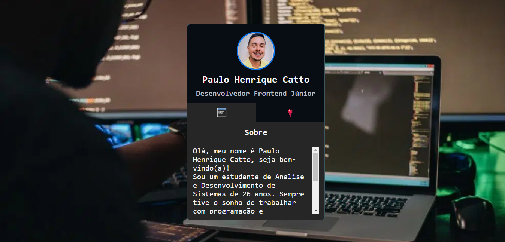
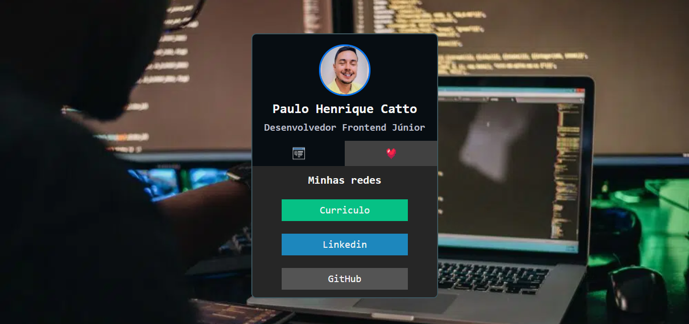

<h1 align="center"> Mini-portfólio </h1>

  <a href="#-projeto">Projeto</a>&nbsp;&nbsp;&nbsp;|&nbsp;&nbsp;&nbsp;
  <a href="#-tecnologias">Tecnologias</a>&nbsp;&nbsp;&nbsp;|&nbsp;&nbsp;&nbsp;

 

  

# Projeto

Meu primeiro projeto criado junto a imersão da Dev em Dobro.

# Tecnologias

Este projeto foi desenvolvido utilizando as seguintes tecnologias:

- HTML e CSS
- JavaScript
- Git e Github

